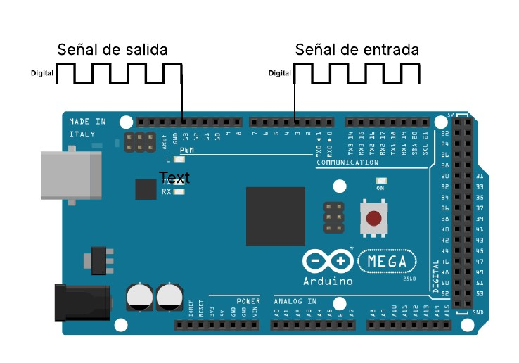

## medir_pulso
Implementación básica que mide el ancho de pulso mediante polling constante del pin.

## medir_pulso_irq 
Implementación óptima que utiliza interrupciones para detectar flancos y medir con mayor precisión.

### Mas detalles
Además de medir el ancho de pulso copia la señal en el PIN 13 de salida e imprime el valor en microsegundo del pulso medido.

